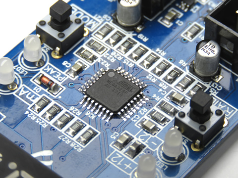

# ATmega328P-A Arduino board definition
**Joran van Gremberghe / [Joranalogue Audio Design](https://joranalogue.com/)**

Released to the Arduino community under the [GPL](https://www.gnu.org/licenses/gpl-3.0.en.html).



This Arduino board definition was written specifically for the 328P-A variant (TQFP-32 package) of the popular [AVR ATmega328P microcontroller](http://www.microchip.com/wwwproducts/en/ATmega328P) used in many Arduino boards and compatible systems. The primary use case for this board definition is projects with custom circuit boards, based on 8-bit Arduino but needing a bit more I/O. It provides **4 additional I/O pins** over the standard Arduino Uno:
* Internal oscillator used at 8 MHz, instead of external 16 MHz crystal. The internal oscillator is less accurate, so this definition is not recommended for timing-sensitive applications. It also effectively halves the microcontroller's performance. However, the external oscillator pins can now be used as **digital I/O pins 14 and 15**.
* The TQFP package includes two additional ADC pins (ADC6 and ADC7), compared to the DIP variant. These pins can now be addressed as **analogue pins 6 and 7**, just like on the Arduino [Nano](https://www.arduino.cc/en/Guide/ArduinoNano) and [Mini](https://www.arduino.cc/en/Guide/ArduinoMini). They can not be used as digital I/O.

Note that there are several variants of the 328P-A: AU, AUR, AN and ANR. These are all functionally equivalent; the extra letters denote temperature range and packaging differences. Compatibility with the 328P-M (MLF-32 package) has not been tested. This definition is not compatible with the 328-A (without 'P'), which is a different part.

Originally written for use in [Test 3](https://github.com/joranvg/test-3), a V/mA meter for Eurorack modular synthesisers.

## Installation
You can install the board definition in two ways: using the Boards Manager in the Arduino IDE, or manually.
### Arduino Boards Manager
This is the recommended installation method. It allows you to easily update the definition in the future, should a new version be released. In the Arudino IDE preferences, add the following URL to the 'Additional Boards Manager URLs' field: `https://raw.githubusercontent.com/joranvg/arduino-atmega328p-a/master/package_joranalogue_atmega328p-a_index.json`

Now open the Boards Manager via 'Tools > Board > Boards Manager...', scroll to and select the 'ATmega328P-A (8 MHz internal clock)' package, and click install. After the installation completes, you should find the 'ATmega328P-A (8 MHz internal clock)' entry under 'Tools > Board'.

### Manual installation
If needed, manual installation is possible as well. Place the `atmega328p-a` folder, found in this repository, in the `hardware` folder of your Arduino sketchbook. By default, this is located at:
* Mac OS: `/Users/<your name>/Documents/Arduino`
* Windows: `C:/Users/<your name>/Documents/Arduino`
* Linux: `/home/<your name>/Sketchbook`

Create the `hardware` folder if it's missing from your sketchbook. Restart the Arduino IDE, and you should now find the 'ATmega32P-A (8 MHz internal clock)' entry under 'Tools > Board'.

## First use
This board definition will typically be used with factory-fresh microcontrollers. Thus, before it can be used, you will first need to set the 328P-A's fuses and burn the Arduino bootloader. An external programmer is needed; a standard Arduino board can be used for this using [these instructions](https://www.arduino.cc/en/Tutorial/ArduinoISP) on the Arduino website.

In the Arduino IDE, select the correct programmer under 'Tools > Programmer'. Also make sure to select the 'ATmega32P-A (8 MHz internal clock)' board under 'Tools > Board'. Now click 'Tools > Burn Bootloader'. This operation both sets the fuses and burns the bootloader. This step is required to set the fuses, even if you're not going to use the Arduino bootloader.

Depending on the application, you can now upload your sketches to the 328P-A via serial or the external programmer.

## Example
Here's a basic example sketch, demonstrating the additional I/O capabilities. The D8-D15 pins go high when the corresponding analog pin's (A0-A7) measured value is 512 or above.

```arduino
void setup()
{
  pinMode(8,  OUTPUT);
  pinMode(9,  OUTPUT);
  pinMode(10, OUTPUT);
  pinMode(11, OUTPUT);
  pinMode(12, OUTPUT);
  pinMode(13, OUTPUT);
  pinMode(14, OUTPUT);
  pinMode(15, OUTPUT);
}

void loop()
{
  digitalWrite(8,  (analogRead(A0) >= 512));
  digitalWrite(9,  (analogRead(A1) >= 512));
  digitalWrite(10, (analogRead(A2) >= 512));
  digitalWrite(11, (analogRead(A3) >= 512));
  digitalWrite(12, (analogRead(A4) >= 512));
  digitalWrite(13, (analogRead(A5) >= 512));
  digitalWrite(14, (analogRead(A6) >= 512));
  digitalWrite(15, (analogRead(A7) >= 512));
}
```

## License
This custom board definition for [Arduino](https://www.arduino.cc/) was based on the default Arduino Uno definition by David A. Mellis (2007), and is released under the same [GPL](https://www.gnu.org/licenses/gpl-3.0.en.html) license. Feel free to use it in your own projects. Commercial use is allowed, but you must attribute and release under the same license.

*This is not an official Arduino project. It is released to the public community without any guarantees or warranties. The Arduino trademark is owned by Arduino AG. Joranalogue Audio Design is in no way affiliated with Arduino AG.*
